# 🏡 BrickView -- Real Estate Analytics Dashboard

## Overview

BrickView is a **Streamlit-based Real Estate Analytics Dashboard** that
enables users to analyze, manage, and explore real estate data using
interactive visualizations and a MySQL backend. The application combines
business analytics with complete CRUD functionality and advanced
filtering for property records.

------------------------------------------------------------------------

## ✨ Key Features

### 📊 Dashboard

-   KPI cards for business metrics
-   Interactive Plotly visualizations
-   Property and sales summaries
-   Market insights

### 📈 Analytics

-   Average Listing Price by City
-   Average Price per Sqft
-   Property Type Analysis
-   Furnishing Status Analysis
-   Metro Distance Analysis
-   Sales Trends
-   Agent Performance
-   Buyer Loan Analysis
-   Revenue Insights

### 📝 CRUD Module

Supports complete data management for: - Listings - Property - Agents -
Buyer - Sales

Operations: - ✅ Create - ✅ Read - ✅ Update - ✅ Delete

### 🔍 Filter Module

Independent filters with dedicated result tables: - Filter by City -
Filter by Property Type - Filter by Price - Filter by Agent - Filter by
Sale Date

------------------------------------------------------------------------

## 🛠️ Technology Stack

  Category             Technologies
  -------------------- ------------------------
  Language             Python
  Frontend             Streamlit
  Database             MySQL
  Visualization        Plotly
  Data Processing      Pandas
  Database Connector   mysql-connector-python

------------------------------------------------------------------------

## 🗂️ Project Structure

``` text
BrickView/
│
├── application.py
├── scripts/
│   ├── Dashboard.py
│   ├── Analytics.py
│   ├── CRUD.py
│   └── Filters.py
├── dataset/
├── images/
└── README.md
```

------------------------------------------------------------------------

## 🗄️ Database Tables

-   Listings
-   Property
-   Agents
-   Buyer
-   Sales

------------------------------------------------------------------------

## 🚀 Installation

1.  Clone the repository

``` bash
git clone https://github.com/<your-username>/BrickView.git
cd BrickView
```

2.  Install dependencies

``` bash
pip install -r requirements.txt
```

3.  Configure MySQL

``` python
host="127.0.0.1"
user="root"
password="YOUR_PASSWORD"
database="brickview"
```

4.  Run the application

``` bash
streamlit run application.py
```

------------------------------------------------------------------------

## 📷 Screenshots

# Dashboard
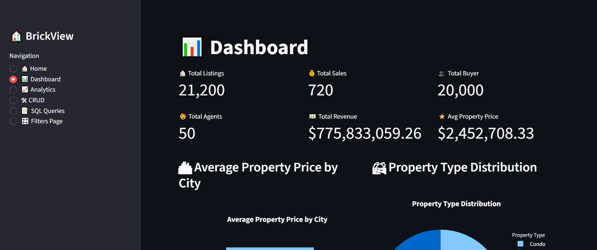
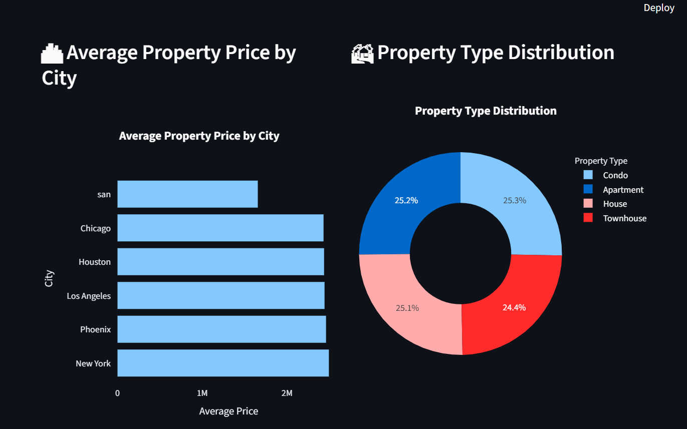
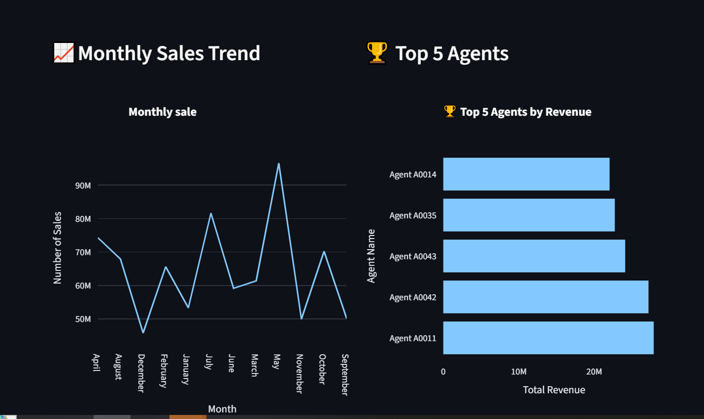

# Analytics
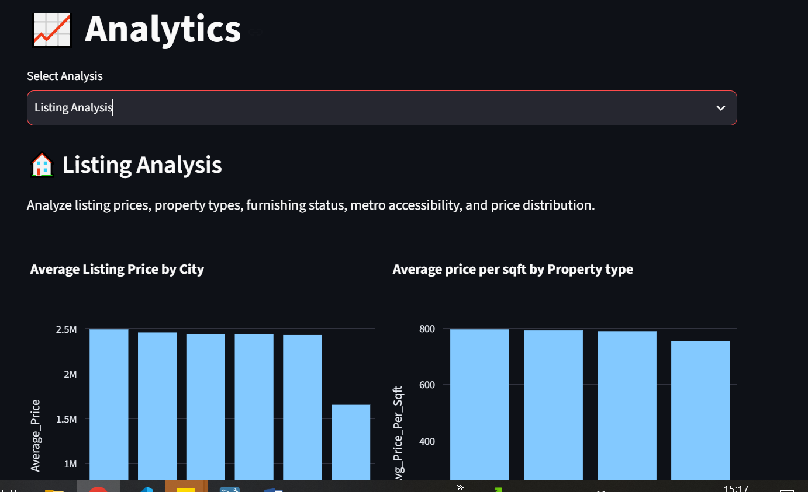
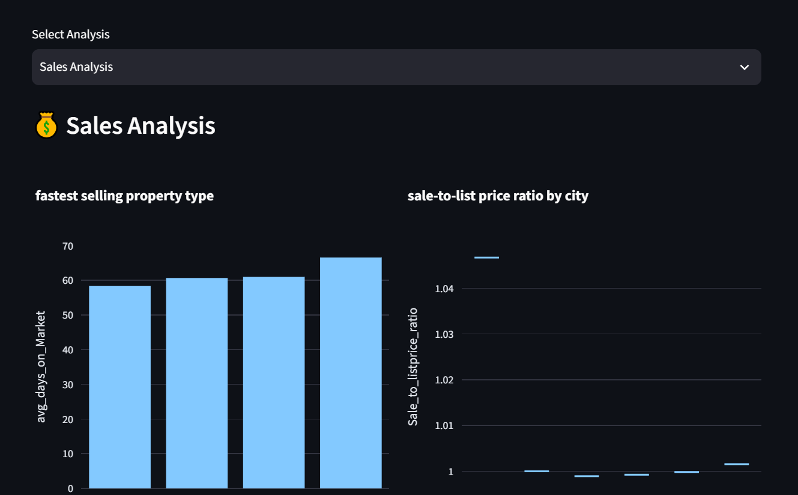
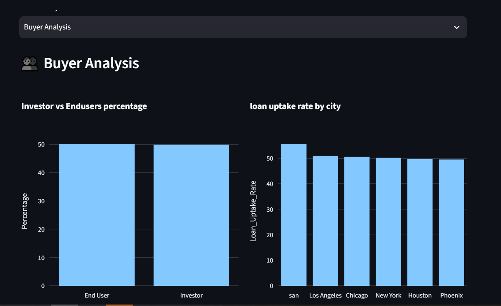
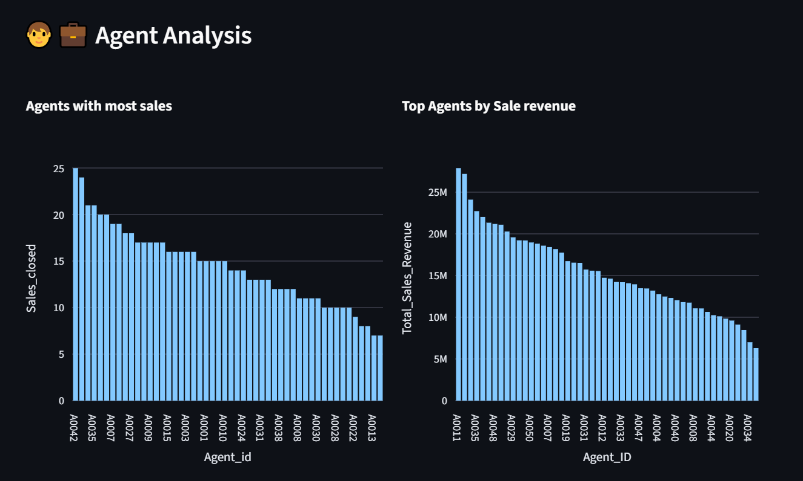
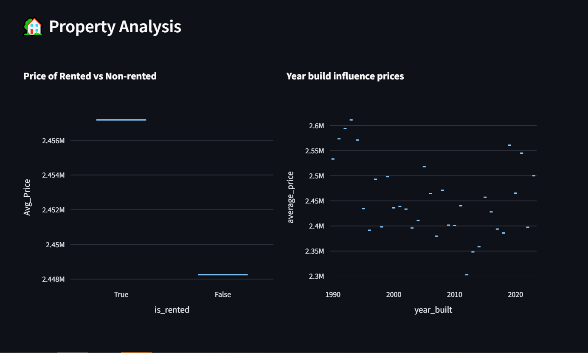

# crud
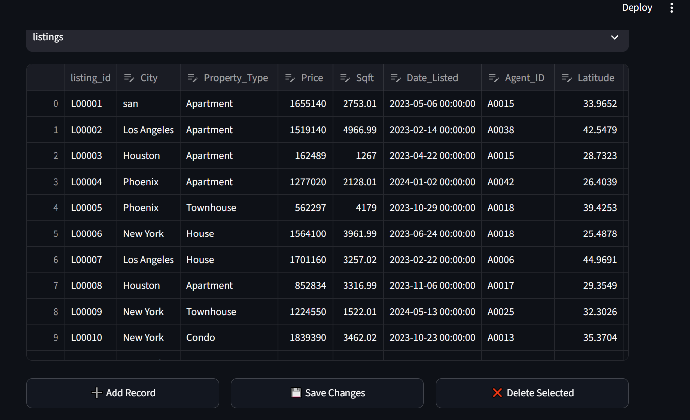

# SQL
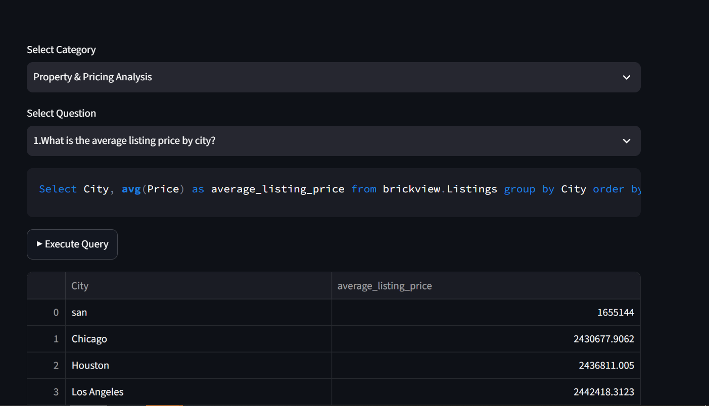

# Filter
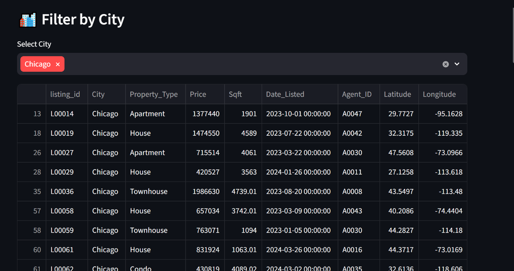
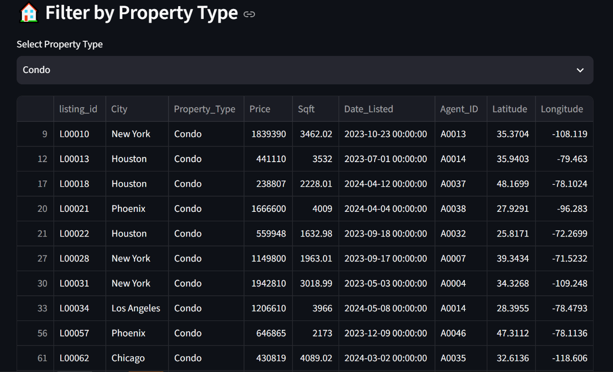
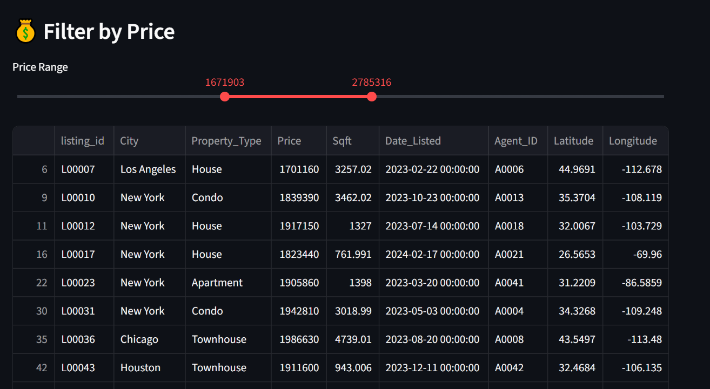
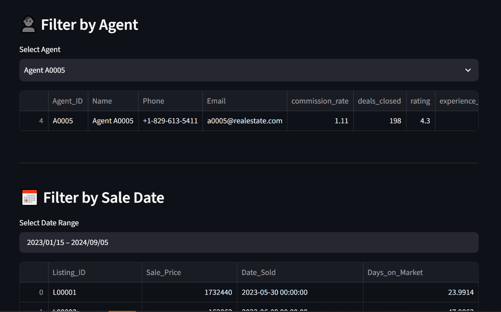
------------------------------------------------------------------------

## 🔮 Future Enhancements

-   User Authentication
-   Search & Global Filtering
-   Export to Excel/PDF
-   Interactive Maps
-   Price Prediction Models

------------------------------------------------------------------------

## 👤 Author

**Santheya Emperumal**

BrickView was developed as a real estate analytics and management
application using **Python, Streamlit, Plotly, Pandas, and MySQL**.

------------------------------------------------------------------------

## 📄 License

This project is intended for educational and portfolio purposes.
